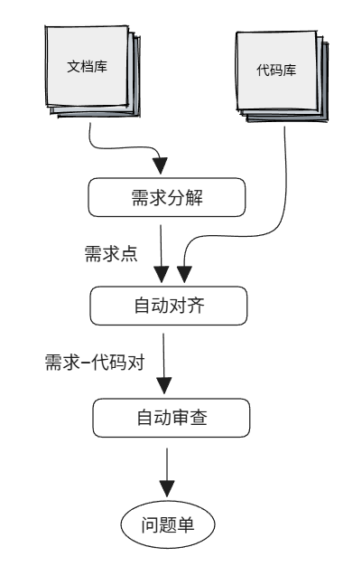
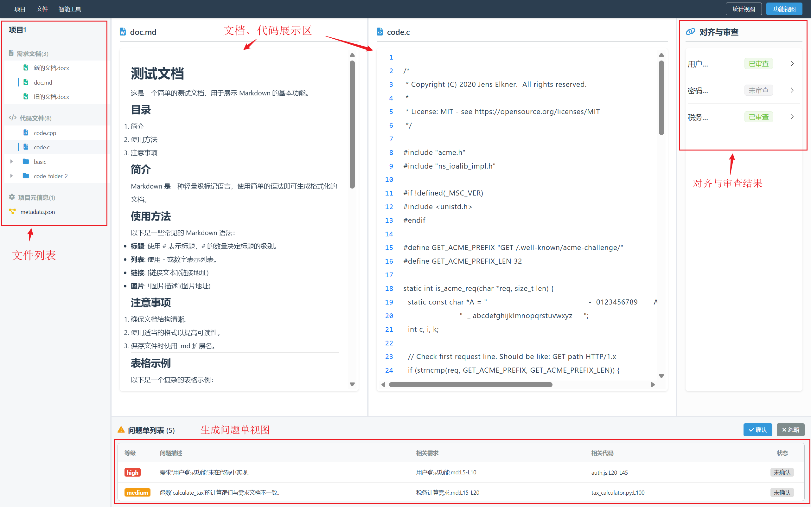

# 需求-代码一致性审查平台

本项目是一个基于 Web 的交互式平台，旨在帮助开发和测试人员审查需求文档与源代码之间的一致性。它结合了大型语言模型（LLM）的智能分析能力和用户的手动操作，提供自动化的对齐、审查、需求反生成等功能。



## 主要功能

- **项目管理**: 创建、导入、管理多文件项目，支持 `code_repo` 和 `doc_repo` 的标准结构。
- **自动化审查**:
    - **需求分解**: 在需求文档中手动或自动划分需求点。
    - **智能对齐**: 自动将需求点与相关的代码块进行对齐。
    - **手动调整**: 支持手动新增、删除、修改代码对齐关系。
    - **一致性审查**: 基于对齐的需求和代码，调用大模型进行一致性分析，并生成问题报告。
- **数据标注**: 提供一个独立的标注界面，用于创建需求与代码之间细粒度的关联数据集。

## 项目结构

```
.
├── app.py                  # Flask 主应用，处理后端逻辑和路由
├── agent.py                # 与大模型交互的代理模块
├── prompt.py               # 存储和格式化发送给大模型的提示词
├── utils.py                # 工具函数（文件处理、文本解析等）
├── doc2md/                 # docx格式转markdown模块
├── history.json            # 存储最近打开的项目历史
├── requirements.txt        # Python 依赖库
├── static/                 # 静态资源
│   ├── css/                # CSS 样式文件
│   ├── js/                 # JavaScript 脚本
│   │   ├── annotation.js   # 标注页面的 Vue.js 逻辑
│   │   ├── project.js      # 项目管理页面的 Vue.js 逻辑
│   │   ├── welcome.js      # 欢迎页面的 Vue.js 逻辑
│   │   └── thirdParty/     # 第三方前端库 (Vue, ElementPlus, etc.)
│   └── fontawesome/        # Font Awesome 图标库
└── templates/              # Flask 模板
    ├── welcome.html        # 欢迎和项目创建/导入页面
    ├── project.html        # 项目主页（文件管理、统计视图）
    └── annotation.html     # 数据标注页面（手动生成需求-代码对齐数据，用于模型训练或测试）
```

## 环境与启动

#### 配置环境
1.  **克隆仓库**:
    ```bash
    git clone https://github.com/code-philia/doc-code-consistency-review.git
    cd doc-code-consistency-review
    ```

2.  **安装 Python 依赖**:
    建议使用 Python 3.8 或更高版本。
    ```bash
    pip install -r requirements.txt
    ```

3.  **前端依赖**:
    本项目所需的前端库（如 Vue.js, ElementPlus）已包含在 `static/js/thirdParty` 目录下，无需额外安装 `Node.js` 或运行 `npm install`（在某些用户场景下无法连接外网，因此采用本地下载库的方式）。

4.  **配置大模型 API (可选)**:
    如果需要使用智能审查功能，请在 `agent.py` 文件中配置您的大模型 API Key 和 endpoint。

#### 启动项目

1.  **运行 Flask 应用**:
    ```bash
    python app.py
    ```

2.  **访问应用**:
    打开浏览器，访问 `http://127.0.0.1:5055`。


## 简单使用指南

1.  **创建或导入项目**:
    - 在欢迎页面，您可以选择“新建项目”来创建一个空的标准项目结构，或“从文件夹创建”来基于现有包含 `code_repo` 和 `doc_repo` 的文件夹创建项目。
    - 您也可以“导入项目”来打开一个之前创建过的项目（一个包含`metadata.json`的目录）。
    - 点击历史打开过的某个项目，进入项目页面。

2.  **智能对齐与审查**:
    - 开发中...✈️

