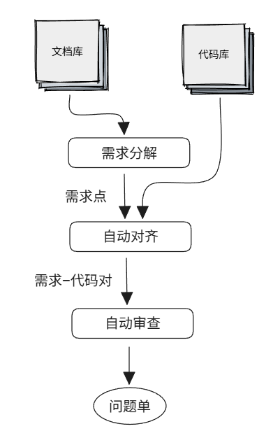

# 需求-代码一致性审查平台

本项目是一个基于 Web 的交互式平台，旨在帮助开发和测试人员审查需求文档与源代码之间的一致性。它结合了大型语言模型（LLM）的智能分析能力和用户的手动操作，提供自动化的对齐、审查、需求反生成等功能。



## 主要功能

- **项目管理**: 创建、导入、管理多文件项目，支持 `code_repo` 和 `doc_repo` 的标准结构。
- **自动化审查**:
    - **需求分解**: 在需求文档中手动或自动划分需求点。
    - **智能对齐**: 自动将需求点与相关的代码块进行对齐。
    - **手动调整**: 支持手动新增、删除、修改代码对齐关系。
    - **一致性审查**: 基于对齐的需求和代码，调用大模型进行一致性分析，并生成问题报告。
- **数据标注**: 提供一个独立的标注界面，用于创建需求与代码之间细粒度的关联数据集。

## 环境与启动

下面按“从零到可运行”给出一套可直接执行的启动步骤，包含虚拟环境、MySQL、Redis、Celery 和 Web 服务。

### 1. 获取代码

```bash
git clone https://github.com/code-philia/doc-code-consistency-review.git
cd doc-code-consistency-review
```

### 2. 创建并激活 Python 虚拟环境

建议 Python 3.10（3.8+ 也可）。

#### 方式 A：`venv`

```bash
python3 -m venv .venv
source .venv/bin/activate
python -m pip install --upgrade pip
pip install -r requirements.txt
```

#### 方式 B：`conda`

```bash
conda create -n doc-code-env python=3.10 -y
conda activate doc-code-env
pip install -r requirements.txt
```

### 3. 配置大模型参数（可选但推荐）

```bash
cp .env.example .env
```

在 `.env` 中填写：
- `API_BASE_URL`
- `API_KEY`
- `MODEL_NAME`

### 4. 检查并启动 MySQL

项目默认 MySQL 配置在 `app/db.py`：
- host: `localhost`
- port: `3306`
- user: `root`
- password: `123456`
- database: `doc_code`

请按你的环境修改 `app/db.py` 的 `DB_CONFIG`。

#### 4.1 检查 MySQL 是否运行

```bash
mysqladmin -h 127.0.0.1 -P 3306 -u root -p ping
```

若返回 `mysqld is alive` 表示正常。

#### 4.2 启动 MySQL（常见 Linux）

```bash
sudo systemctl status mysql
sudo systemctl start mysql
sudo systemctl enable mysql
```

部分发行版服务名是 `mysqld`，可改为：

```bash
sudo systemctl status mysqld
sudo systemctl start mysqld
sudo systemctl enable mysqld
```

#### 4.3 初始化数据库与表结构

```bash
mysql -h 127.0.0.1 -P 3306 -u root -p -e "CREATE DATABASE IF NOT EXISTS doc_code DEFAULT CHARACTER SET utf8mb4;"
mysql -h 127.0.0.1 -P 3306 -u root -p doc_code < schema.sql
```

#### 4.4 执行数据库迁移脚本

如果只是增量执行某个迁移脚本，可以直接运行：

```bash
mysql -h 127.0.0.1 -P 3306 -u root -p123456 doc_code < add_doc_code_blocks_tables.sql
```

如果后续有新的迁移脚本，只需要把命令最后的脚本文件名替换掉即可。

### 5. 检查并启动 Redis

Celery 使用的 Redis 地址在 `tasks.py`：
- broker: `redis://localhost:6379/0`
- backend: `redis://localhost:6379/0`

#### 5.1 检查 Redis 是否运行

```bash
redis-cli -h 127.0.0.1 -p 6379 ping
```

若返回 `PONG` 表示正常。

#### 5.2 启动 Redis（常见 Linux）

```bash
sudo systemctl status redis
sudo systemctl start redis
sudo systemctl enable redis
```

部分发行版服务名是 `redis-server`，可改为：

```bash
sudo systemctl status redis-server
sudo systemctl start redis-server
sudo systemctl enable redis-server
```

### 6. 启动 Celery Worker（新终端）

先进入项目目录并激活同一个虚拟环境，然后启动：

```bash
celery -A tasks.celery worker --loglevel=info
```

如果你希望更高并发，可按需设置：

```bash
celery -A tasks.celery worker --loglevel=info --concurrency=4
```

### 7. 启动 Flask Web 服务（另一个新终端）

同样先激活虚拟环境，然后执行：

```bash
python run.py
```

默认监听：`http://127.0.0.1:5000`（`run.py` 配置为 `0.0.0.0:5000`）。

### 8. 启动后快速自检

#### 8.1 检查端口

```bash
ss -lntp | grep -E "5000|6379|3306"
```

#### 8.2 检查 Celery 是否连上 Redis

```bash
celery -A tasks.celery inspect ping
```

若返回 `pong`，说明 worker 正常。

### 9. 推荐启动顺序

1. 激活虚拟环境  
2. 启动 MySQL  
3. 启动 Redis  
4. 启动 Celery worker  
5. 启动 Flask (`python run.py`)  
6. 浏览器访问 `http://127.0.0.1:5000`
